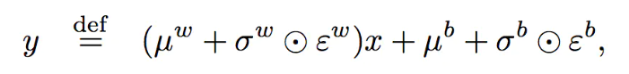
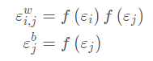
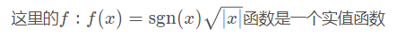
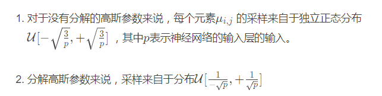

# Nosiy Net

## 1. 目的

增强Agent的探索能力

## 2. 常用方式

- 使用e-greedy
- 正则化网络熵

## 3. 原理

通过对模型增加噪声来增加模型的探索能力

噪声的添加通常是在全连接层，原来的全连接层前向计算公式为：$y=wx+b$

假设前面一层的神经元的个数为p，后面一层神经元的个数为q，那么有

- x.shape=(p,1)
- b.shape=(q,1)
- y.shape=(q,1)
- w.shape=(q,p)

要在此基础上加上噪声，那么就是使得每一个w和b的取值都服从参数为u，方差为σ的正态分布，同时存在一定的随机噪声ε，先假设噪声ε是服从标准正态分布N(0,1)的，那么前向计算公式为

这样子，参数的个数就从p*q+q个，变为了2*(p*q+q)个，其中噪声ε视为一个随机产生的常量，不是一个变量。那么噪声ε生成的方式就有两种：

1. 独立高斯分布：每个w和b的噪声都使用不同的标准正态分布产生，这样是效率低下的
2. 分解高斯噪声：包含噪音的输入输出：第一个具有输入p个单位的高斯分布ε 噪音输入，第二个具有q个单位的高斯噪音输出。共 ( p + q )  个变量，其分解如下噪声：

下面就是w和b的初始化，来自正态分布：

对于b的初始化：分子部分为0.4
