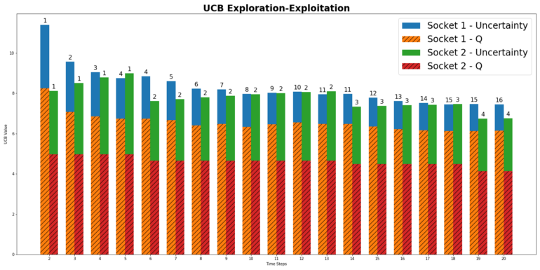

# 信心上限策略（UCB）

## 1. 背景

在一定的时间内，找到利用-探索的平衡

每次去寻找动作中最优的，显而易见的是达不到的。每次状态开始的时候并不知道各种动作所能带来的回报，所以有时候选取的动作不是最优的。

遗憾：目前的最优策略与真实策略所带来的的回报之间的差距

## 2. 公式

$$
A_t=\underset {a} {argmax} [Q_t(a)+c \frac {\sqrt {logt}} {N_t(a)}]
$$

公式解读：

1. 对于利用的解读
2. 对于探索的解读

- $Q_t(a)$表示当前动作a的价值，是利用部分，根据已经有的经验知识计算出动作a的价值
- $c\sqrt{ \frac {logt} {N_t(a)} }$表示对于动作a的探索部分，也就是根据环境的不确定性，计算动作a的不确定性的大小
  - $t$：时间
  - $N_t(a)$：动作a被使用的次数
  - $c$：信心度
- 随着时间的增加，$logt$的值会一直增加，如果动作a已知都没有被使用，那么$N_t(a)$的值会非常小，那么作为分母的它会使得这个不确定的一项非常大，导致动作a的不确定性增加，使得a更加被有可能被采取。c为信心度，一般这个值确定的是探索的程度，也就是探索在这个公示中所占的权值，如果c很大，那么说明探索的比例要高一些。也不是说c越大越好，实验表明，c的值一般取在**0.6，使得模型的表现最好。**

